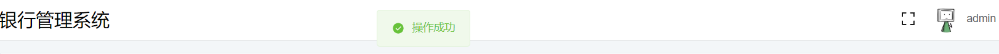
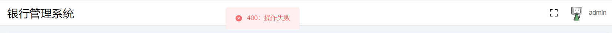

# 银行管理系统 实验报告

## 小组分工

王琛 PB20111696 前后端框架实现、界面ui设计与对应实验报告撰写

王骥扬 PB20111697

## 需求/功能分析

### 需求分析

​	TBD

### ER图

​	TBD

### 数据库模式

​	TBD

## 数据库设计

### 设计框架

​	采用 B/S 架构实现数据库系统，前端采用 Vue 框架，后端采用 Spring Boot 框架，数据库平台使用 Mysql

### 语言

​	NodeJS：Vue

​	Java：Spring Boot

​	Sql：Mysql

### 界面UI设计

​	前端 ui 采用 vue3 中的 element-plus 插件实现

#### css 设计

```css
html {
    -ms-overflow-style: none;
    overflow: -moz-scrollbars-none;
    overflow: hidden;
    overflow-y: scroll;
    scrollbar-width: none;
}

html::-webkit-scrollbar {
    width: 0 !important;
}

body {
    -webkit-text-size-adjust: 100%;
    -moz-osx-font-smoothing: grayscale;
    -webkit-font-smoothing: antialiased;
    text-rendering: optimizeLegibility;
    font-family: Helvetica Neue, Helvetica, PingFang SC, Hiragino Sans GB, Microsoft YaHei, Arial, sans-serif;
}

body,
ol,
ul,
h1,
h2,
h3,
h4,
h5,
h6,
p,
th,
td,
dl,
dd,
form,
fieldset,
legend,
input,
textarea,
select {
    margin: 0;
    padding: 0;
}

a {
    text-decoration: none;
}

a:hover {
    text-decoration: underline;
}

em {
    font-style: normal;
}

img {
    border: 0;
    vertical-align: middle;
}

table {
    border-collapse: collapse;
    border-spacing: 0;
}

p {
    word-wrap: break-word;
}
```

#### 登录界面

​	在 el-card 中使用 el-form 显示登录表单

```vue
<template>
    <div class="login">
        <el-card class="login_center">
            <template #header>
                <div class="card_header">
                    <span>用户登录</span>
                </div>
            </template>
            <el-form :model="loginFormState" :rules="rules" ref="loginFormRef">
                <el-form-item prop="name">
                    <el-input v-model.trim="loginFormState.name" maxlength="32" placeholder="请输入账号" clearable>
                        <template #prefix>
                            <icons name="User"></icons>
                        </template>
                    </el-input>
                </el-form-item>
                <el-form-item prop="pwd">
                    <el-input v-model.trim="loginFormState.pwd" maxlength="16" show-password placeholder="请输入密码" clearable
                        @keyup.enter.exact="handleLogin">
                        <template #prefix>
                            <icons name="Lock"></icons>
                        </template>
                    </el-input>
                </el-form-item>
                <el-form-item>
                    <el-button type="primary" style="width: 100%" :loading="loginFormState.loading" @click="handleLogin">登
                        录</el-button>
                </el-form-item>
            </el-form>
        </el-card>
    </div>
</template>
```


#### 主界面

​	主界面由侧边栏和顶栏组合构成，共同放在 el-container 布局容器中

```vue
<template>
    <el-container class="layout">
        <Aside />
        <el-container>
            <Header />
            <div class="app_wrap">
                <el-main>
                    <router-view />
                </el-main>
                <!-- footer -->
                <el-footer height="48px">Copyright &copy; {{ year }}</el-footer>
                <!-- backtop -->
                <el-backtop target=".app_wrap"></el-backtop>
            </div>
        </el-container>
    </el-container>
</template>
```


##### 侧边栏

​	侧边栏在 el-aside 中嵌套 el-menu 构成，其中侧边栏的菜单由状态管理模式插件 Vuex 动态提供

```vue
<template>
    <el-aside :width="isCollapse ? `64px` : `200px`">
        <div class="logo">
            
        </div>
        <el-menu background-color="#001529" text-color="#eee" active-text-color="#fff" router unique-opened
            :default-active="route.path" :collapse="isCollapse">
            <template v-for="item in routers" :key="item.name">
                <template v-if="!item['hidden']">
                    <el-sub-menu v-if="item.children && item.children.length" :index="concatPath(item.path)">
                        <template #title>
                            <Icons v-if="item.meta.icon" :name="item.meta.icon" />
                            <span>{{ item.meta.title }}</span>
                        </template>
                        <template v-for="sub in item.children" :key="sub.name">
                            <el-menu-item :index="concatPath(item.path, sub.path)">
                                <Icons v-if="sub.meta['icon']" :name="sub.meta['icon']" />
                                <template #title>{{ sub.meta.title }}</template>
                            </el-menu-item>
                        </template>
                    </el-sub-menu>
                    <el-menu-item v-else :index="concatPath(item.path)">
                        <Icons v-if="item.meta['icon']" :name="item.meta['icon']" />
                        <template #title>{{ item.meta.title }}</template>
                    </el-menu-item>
                </template>
            </template>
        </el-menu>
        <div class="fold" @click="changeCollapse">
            <Icons v-if="!isCollapse" name="d-arrow-left" />
            <Icons v-else name="d-arrow-right" />
        </div>
    </el-aside>
</template>
```

##### 顶栏

​	顶栏使用 el-header ，其中包含银行管理系统的标题，用户的名称与用户的头像，全屏与退出全屏按钮。用户的名称与头像由 Vuex动态提供

```vue
<template>
    <el-header height="56px">
        <div class="header_left">银行管理系统</div>
        <div class="header_right">
            <el-tooltip :content="isFullScreen ? '退出全屏' : '全屏'">
                <Icons name="full-screen" @click.stop="handleFullScreen" />
            </el-tooltip>
            <el-dropdown size="medium" @command="handleCommand">
                <div class="user_info">
                    <el-avatar :size="36" :src="avatar" />
                    <span class="username">{{ userName }}</span>
                </div>
                <template #dropdown>
                    <el-dropdown-menu>
                        <el-dropdown-item command="user">个人中心</el-dropdown-item>
                        <el-dropdown-item command="logout">退出登录</el-dropdown-item>
                    </el-dropdown-menu>
                </template>
            </el-dropdown>
        </div>
    </el-header>
</template>
```

##### 数据展示

​	数据表格使用 el-table 显示，按钮使用 el-button 显示，分页使用 el-pagination 显示，对话框使用 el-dialog 显示

```vue
<template>
    <el-card shadow="never" class="index">
        <template #header>
            <div class="card_header">
                <b>用户列表</b>
                <div>
                    <el-button color="#056DE8" @click="addDialogFormVisible = true">增加</el-button>
                    <el-button color="#056DE8" @click="searchDialogFormVisible = true">搜索</el-button>
                </div>
            </div>
        </template>
        <!-- <el-empty description="暂无数据"></el-empty> -->

        <el-table :data="tableData" stripe style="width: 100%">
            <el-table-column prop="name" label="用户名"></el-table-column>
            <el-table-column label="密码">
                <template #default="scope">
                    <el-input v-show="scope.row.showmode" v-model="scope.row.password"></el-input>
                    <p v-show="!scope.row.showmode">{{ scope.row.password }}</p>
                </template>
            </el-table-column>
            <el-table-column label="操作">
                <template #default="scope">
                    <el-button @click="scope.row.showmode = true" type='primary' size="small">编辑</el-button>
                    <el-button @click="handleEdit(scope.row)" type='success' size="small">保存</el-button>
                    <el-button @click="handleDelete(scope.row)" type='danger' size="small">删除</el-button>
                </template>
            </el-table-column>
        </el-table>

        <div style="padding: 10px 0">
            <el-pagination v-model:current-page="currentPage" v-model:page-size="pageSize" :page-sizes="[2, 4, 10, 20]"
                layout="total, sizes, prev, pager, next, jumper" :total="count" @size-change="handleSizeChange"
                @current-change="handleCurrentChange" />
        </div>

        <el-dialog v-model="addDialogFormVisible" title="增加">
            <el-form :model="addForm">
                <el-form-item label="用户名" label-width=100px>
                    <el-input v-model="addForm.name" autocomplete="off" />
                </el-form-item>
                <el-form-item label="密码" label-width=100px>
                    <el-input v-model="addForm.password" autocomplete="off" />
                </el-form-item>
            </el-form>
            <template #footer>
                <span class="dialog-footer">
                    <el-button @click="addDialogFormVisible = false">取消</el-button>
                    <el-button type="primary" @click="handleAdd()">确定</el-button>
                </span>
            </template>
        </el-dialog>

        <el-dialog v-model="searchDialogFormVisible" title="搜索">
            <el-form :model="searchForm">
                <el-form-item label="用户名" label-width=100px>
                    <el-input v-model="searchForm.name" autocomplete="off" />
                </el-form-item>
            </el-form>
            <template #footer>
                <span class="dialog-footer">
                    <el-button @click="searchDialogFormVisible = false">取消</el-button>
                    <el-button type="primary" @click="handleSearch()">确定</el-button>
                </span>
            </template>
        </el-dialog>
    </el-card>
</template>
```


#### 提示信息

​	提示信息使用 ElMessage 显示





### 前端功能实现

#### 进度条

​	进度条使用插件 nprogress 实现，在路由中引入

```javascript
import NProgress from "nprogress";
import "nprogress/nprogress.css";
```

​	在进入路由时开始进度条

```javascript
NProgress.start();
```

​	在退出路由后终止进度条

```javascript
NProgress.done();
```

#### 状态管理

​	状态管理使用插件 Vuex 实现，用于传递用户信息相关的状态。

```javascript
import { createStore } from "vuex";
import { CLEAR_USER, SET_USER, SET_ROUTES } from "./mutation-types";
import { layoutMap } from "@/router/router";
import { filterAsyncRouter } from "../utils/tool";

const state = {
    users: null,
    routers: []
};

const getters = {
    getUserName(state) {
        return !state.users ? "" : state.users.username;
    }
};

const mutations = {
    [CLEAR_USER](state) {
        state.users = null;
        state.routers = [];
    },
    [SET_USER](state, payload) {
        state.users = payload;
    },
    [SET_ROUTES](state, payload) {
        state.routers = payload;
    }
};

const actions = {
    clearUser({ commit }) {
        commit(CLEAR_USER);
    },
    setUser({ commit }, payload) {
        let deepCopy = JSON.parse(JSON.stringify(layoutMap)),
            accessedRouters = filterAsyncRouter(deepCopy, payload.role);
        commit(SET_USER, payload);
        commit(SET_ROUTES, accessedRouters);
    }
};

export default createStore({
    state,
    getters,
    mutations,
    actions
});

```

​	其中状态包含用户名和用户被授权访问的路由信息，定义了设置用户信息与清除用户信息的函数。其中在设置用户信息的函数中，将调用函数时的负载通过 filterAsyncRouter 解析为用户被授权访问的路由信息

```javascript
/* 处理权限 */
export const hasPermission = (route, role) => {
    if (route.meta && route.meta.roles) {
        return route.meta.roles.includes(role);
    }
    return true; /* 默认不设权限 */
};

export const filterAsyncRouter = (routerMap, roles) => {
    const accessedRouters = routerMap.filter(route => {
        if (hasPermission(route, roles)) {
            if (route.children && route.children.length) {
                route.children = filterAsyncRouter(route.children, roles);
            }
            return true;
        }
        return false;
    });
    return accessedRouters;
};

```

​	用户的状态在用户登录时被设置

```javascript
store.dispatch("setUser", params);
```

​	在用户退出登录或登录超时的时候被清空

```javascript
store.dispatch("clearUser");
```

#### 路由

​	路由使用插件 vue-router 实现

```javascript
import { createRouter, createWebHistory } from 'vue-router'
```

​	路由表项共有两项，登录界面与主界面

```javascript
const router = createRouter({
  history: createWebHistory(import.meta.env.BASE_URL),
  routes: [...routes]
})
const routes = [
    {
        path: '/Login',
        name: 'login',
        component: () => import('@/views/Login/Login.vue')
    },
    {
        path: "/",
        name: "Layout",
        component: Layout,
        children: [...layoutMap]
    }
];
```

​	其中 layoutMap 为主界面下的菜单项

```javascript
const layoutMap = [
    {
        path: "user",
        name: "User",
        meta: { title: "用户列表", icon: "User", roles: ["admin"] },
        component: () => import("@/views/Admin/User.vue")
    },
    {
        path: "sub_bank",
        name: "Sub_bank",
        meta: { title: "支行管理", icon: "CreditCard", roles: ["admin"] },
        component: () => import("@/views/Admin/Sub_bank.vue")
    },
    {
        path: "department",
        name: "Department",
        component: RouteView,
        meta: { title: "部门管理", icon: "Document" },
        children: [
            {
                path: "department",
                name: "Department",
                meta: { title: "部门" },
                component: () => import("@/views/Department/Department.vue")
            },
            {
                path: "member",
                name: "Member",
                meta: { title: "员工" },
                component: () => import("@/views/Department/Member.vue")
            },
        ]
    },
    {
        path: "client",
        name: "Client",
        component: RouteView,
        meta: { title: "客户管理", icon: "DataLine" },
        children: [
            {
                path: "client",
                name: "Client",
                meta: { title: "客户" },
                component: () => import("@/views/Client/Client.vue")
            },
            {
                path: "credit_account",
                name: "Credit_account",
                meta: { title: "信用账户" },
                component: () => import("@/views/Client/Credit_account.vue")
            },
            {
                path: "saving_account",
                name: "Saving_account",
                meta: { title: "储蓄账户" },
                component: () => import("@/views/Client/Saving_account.vue")
            }
        ]
    },
    {
        path: "loan",
        name: "Loan",
        component: RouteView,
        meta: { title: "贷款管理", icon: "Coin" },
        children: [
            {
                path: "loan",
                name: "Loan",
                meta: { title: "贷款" },
                component: () => import("@/views/Loan/Loan.vue")
            },
            {
                path: "pay_status",
                name: "Pay_status",
                meta: { title: "支付情况" },
                component: () => import("@/views/Loan/Pay_status.vue")
            }
        ]
    }
];
```

##### 路由守护

​	在路由前验证用户的登录状态，阻止尚未登录的用户访问主界面

​	校验用户是否具有访问菜单的权限，阻止没有权限的用户访问对应的页面

```javascript
router.beforeEach((to, from, next) => {
  NProgress.start();
  const jwt = sessionStorage.getItem('jwt')
  const islogin = !!jwt
  if (islogin) {
    if (to.name === 'login') {
      next({ name: 'Layout' })
    } else if (to.meta.hasOwnProperty("roles")) {
      let roles = to.meta.roles || [];
      let { role } = JSON.parse(jwt);
      if (roles.includes(role)) {
        next()
      } else {
        next({ name: 'Layout' })
      }
    } else {
      next()
    }
  } else {
    if (to.name === 'login') {
      next()
    } else {
      next({ name: 'login' })
    }
  }
})
```

#### 登录验证

​	在登录后，使用 Vuex 存储用户名和路由菜单，使用 sessionStorage 存储后端授权给前端的 token 以及用户的身份信息

```javascript
sessionStorage.setItem("token", res.data.data);
sessionStorage.setItem("jwt", JSON.stringify(params));
store.dispatch("setUser", params);
```

​	在每次请求前，在请求的 headers 中包含保存的 token 交给后端校验

```javascript
request.interceptors.request.use((config) => {
    config.headers['token'] = sessionStorage.getItem('token');
    return config;
}, (error) => {
    return Promise.reject(error);
});
```

​	在请求返回后，查询返回的状态码，若返回 token 不合法，则清空用户信息，此时会自动路由到登录界面

```javascript
request.interceptors.response.use((response) => {
    if (response.data.code === 401 || response.data.code === 402) {
        sessionStorage.clear();
    }
    return response;
}, (error) => {
    return Promise.reject(error);
});
```

#### 前后端交互

​	使用 axios 实现前端和后端之间的跨域访问

```javascript
import axios from "axios";

const request = axios.create({
    baseURL: "http://localhost:8081",
    timeout: 5000,
});
```

##### 页面数据获取与操作

​	将前端的操作转化成对应的 get 或 post 请求发送给后端

```javascript
        const load = () => {
            request({ url: baseurl + "/page", method: "post", params: { page: currentPage.value, size: pageSize.value }, data: searchForm }).then(res => {
                if (res.data.code == 200) {
                    tableData.value = res.data.data.data;
                    count.value = res.data.data.count;
                } else {
                    ElMessage.error(res.data.code + "：" + res.data.message);
                }
            }).catch(err => {
                ElMessage.error(err);
            });
        };

        onMounted(() => {
            load();
        });

        const handleEdit = (data) => {
            request.post(baseurl + "/edit", data).then(res => {
                load();
                if (res.data.code == 200) {
                    ElMessage.success(res.data.message);
                } else {
                    ElMessage.error(res.data.code + "：" + res.data.message);
                }
            }).catch(err => {
                ElMessage.error(err);
            });
            data.showmode = false;
        };

        const handleDelete = (data) => {
            request.post(baseurl + "/delete", data).then(res => {
                load();
                if (res.data.code == 200) {
                    ElMessage.success(res.data.message);
                } else {
                    ElMessage.error(res.data.code + "：" + res.data.message);
                }
            }).catch(err => {
                ElMessage.error(err);
            });
        };

        const handleSizeChange = (number) => {
            pageSize.value = number;
            load();
        };

        const handleCurrentChange = (number) => {
            currentPage.value = number;
            load();
        };

        const handleAdd = () => {
            request.post(baseurl + "/add", addForm).then(res => {
                load();
                if (res.data.code == 200) {
                    ElMessage.success(res.data.message);
                } else {
                    ElMessage.error(res.data.code + "：" + res.data.message);
                }
            }).catch(err => {
                ElMessage.error(err);
            });
            addDialogFormVisible.value = false;
            Object.keys(addForm).forEach(key => {
                addForm[key] = "";
            });
        };

        const handleSearch = () => {
            load();
            searchDialogFormVisible.value = false;
            Object.keys(searchForm).forEach(key => {
                searchForm[key] = "";
            });
        };
```

#### mock

​	使用 mockjs 插件模拟后端，从而分离前后端设计便于调试

```javascript
import Mock from "mockjs"
let userlist = [
    {
        name: "admin",
        password: "123456"
    },
    {
        name: "user",
        password: "111111"
    }
]


Mock.mock("/api/login", "post", (params) => {
    let bodyData = JSON.parse(params.body);

    let result = userlist.find(item => {
        return item.name === bodyData.name && item.password === bodyData.password
    }
    )
    if (result) {
        return {
            code: "0",
            message: "登录成功"
        };
    }
    return {
        code: "1",
        message: "登录失败"
    };
})

Mock.mock("/api/getUserList", "get", () => {
    return {
        data: userlist
    };
})

Mock.mock("/api/editUser", "post", (params) => {
    let bodyData = JSON.parse(params.body);
    let result = userlist.find(item => {
        return item.name === bodyData.name
    }
    )
    if (result) {
        result.password = bodyData.password;
        return {
            code: "0",
            message: "编辑成功"
        };
    }
    return {
        code: "1",
        message: "编辑失败"
    };
})


Mock.mock("/api/addUser", "post", (params) => {
    let bodyData = JSON.parse(params.body);
    userlist.push(bodyData);
    return {
        code: "0",
        message: "添加成功"
    };
})

Mock.mock("/api/deleteUser", "post", (params) => {
    let bodyData = JSON.parse(params.body);
    let index = userlist.findIndex(item => {
        return item.name === bodyData.name
    }
    )
    if (index > -1) {
        userlist.splice(index, 1);
        return {
            code: "0",
            message: "删除成功"
        };
    }
    return {
        code: "1",
        message: "删除失败"
    };
})
```

### 后端功能实现

#### 后端的五层框架

​	后端使用 Spring Boot 实现，总体上包含五层，dto（数据传输层），controller（访问控制层），service（业务逻辑层），mapper（数据库访问层），entity（实体层）

​	在 dto 层中定义了前端与后端传输数据的对象。

​	在 controller 层中定义了后端提供给前端的端口

​	在 service 中实现了各个业务的逻辑实现

​	在 mapper 中实现了后端与数据库的交互，即对应 sql 语句的执行

​	在 entity 中定义了数据库所用的实体，用于执行 sql 语句

#### 后端与前端交互

​	在 controller 层中定义了后端提供给前端的端口，使用 @RequestMapping 与 @PostMapping 将请求映射到对应函数上，使用 @RestController 注解将当前修饰的类注入 SpringBoot IOC 容器的同时将返回值使用 @ResponseBody 修饰，使用 @RequestBody 与 @RequestParam 注解解析请求中含有的参数与负载

```java
@RestController
@RequestMapping("/user")
public class UserController {
    final UserService userService;

    @Autowired
    public UserController(UserService userService) {
        this.userService = userService;
    }

    @PassToken
    @PostMapping("/login")
    public Response login(@RequestBody User user) {
        return userService.login(user);
    }

    @PostMapping("/edit")
    public Response edit(@RequestBody User user) {
        return userService.edit(user);
    }

    @PostMapping("/add")
    public Response add(@RequestBody User user) {
        return userService.add(user);
    }

    @PostMapping("/delete")
    public Response delete(@RequestBody User user) {
        return userService.delete(user);
    }

    @PostMapping("/page")
    public Response page(@RequestParam Integer page, @RequestParam Integer size, @RequestBody User user) {
        return userService.page(page, size, user);
    }
}
```

#### 跨域访问

​	加入跨域访问配置，允许各种类型的跨域访问

```java
@Configuration
public class CrossConfig implements WebMvcConfigurer {
    @Override
    public void addCorsMappings(CorsRegistry registry) {
        registry.addMapping("/**").allowedOriginPatterns("*").allowedMethods("GET", "HEAD", "POST", "DELETE", "OPTIONS", "PUT").allowCredentials(true).maxAge(3600).allowedHeaders("*");
    }
}
```

#### 后端与数据库交互

​	后端使用 Mybatis 与 JDBC 库实现 Java与 Mysql 数据库的交互

​	在 mapper 中实现了后端与数据库的交互，即对应 sql 语句的执行，使用 @Select 和 @Delete 注解将 sql 语句绑定到对应函数上，使用 @Options 注解设置 sql 语句的执行配置

```java
@Mapper
public interface ClientMapper {

    @Options(statementType = StatementType.CALLABLE)
    @Select("Call edit_client ( #{client.client_ID},#{client.real_name},#{client.client_phone},#{client.client_address},#{client.client_email}, #{map.status, mode=OUT, jdbcType=INTEGER});")
    Integer edit(@Param("client") Client client, Map<String, Object> map);

    @Options(statementType = StatementType.CALLABLE)
    @Select("Call register ( #{client.client_ID},#{client.real_name},#{client.client_phone},#{client.client_address},#{client.client_email}, #{map.status, mode=OUT, jdbcType=INTEGER});")
    Integer add(@Param("client") Client client, Map<String, Object> map);

    @Delete("delete from client where client_ID = #{client_ID}")
    void delete(Client client);

    @Select("select count(*) from client where client_ID like concat('%', #{client_ID}, '%') and real_name like concat('%', #{real_name}, '%') and client_phone like concat('%', #{client_phone}, '%') and client_address like concat('%', #{client_address}, '%') and client_email like concat('%', #{client_email}, '%')")
    Integer count(Client client);

    @Select("select client_ID, real_name, client_phone, client_address, client_email from client where client_ID like concat('%', #{client.client_ID}, '%') and real_name like concat('%', #{client.real_name}, '%') and client_phone like concat('%', #{client.client_phone}, '%') and client_address like concat('%', #{client.client_address}, '%') and client_email like concat('%', #{client.client_email}, '%') limit #{start}, #{size}")
    List<Client> page(Integer start, Integer size, @Param("client") Client client);
}
```

#### 异常处理

​	定义异常类继承RuntimeException，并加入 code 表示状态码

```java
@Getter
public class MyException extends RuntimeException {
    private final Integer code;

    public MyException(ResponseEnum responseEnum) {
        super(responseEnum.getMessage());
        this.code = responseEnum.getCode();
    }
}
```

​	加入自定义异常处理，在发生异常时返回响应信息与状态码

```java
@RestControllerAdvice
public class GlobalExceptionConfig {
    @ExceptionHandler(MyException.class)
    public Response handle(MyException e) {
        e.printStackTrace();
        return new Response(e.getCode(), e.getMessage(), null);
    }
}
```

#### jwt鉴权

​	自定义注解 @PassToken ，使用 @PassToken 注解修饰的对象将被排除在 jwt 鉴权之外，用于登录场景

```java
@Target({ElementType.METHOD, ElementType.TYPE})
@Retention(RetentionPolicy.RUNTIME)
public @interface PassToken {
    boolean required() default true;
}
```

​	定义 JwtTokenUtils 用于在用户登录时获取 token

```java
public class JwtTokenUtils {

    private static final long EXPIRE_TIME = 10000 * 60 * 1000;

    public static String getToken(User user) {
        Date date = new Date(System.currentTimeMillis() + EXPIRE_TIME);
        return JWT.create().withAudience(user.getName()).withExpiresAt(date).sign(Algorithm.HMAC256(user.getPassword()));
    }

}
```

​	继承 HandlerInterceptor 定义 JwtInterceptor 在请求前拦截进行 jwt 鉴权，在鉴权失败时直接抛出异常

```java
    public boolean preHandle(HttpServletRequest httpServletRequest, HttpServletResponse httpServletResponse, Object object) throws Exception {
        String token = httpServletRequest.getHeader("token");

        if (!(object instanceof HandlerMethod)) {
            return true;
        }

        HandlerMethod handlerMethod = (HandlerMethod) object;
        Method method = handlerMethod.getMethod();

        if (method.isAnnotationPresent(PassToken.class)) {
            PassToken passToken = method.getAnnotation(PassToken.class);
            if (passToken.required()) {
                return true;
            }
        }

        if (token == null) {
            throw new MyException(ResponseEnum.NO_TOKEN);
        }

        String name;
        try {
            name = JWT.decode(token).getAudience().get(0);
        } catch (JWTDecodeException j) {
            j.printStackTrace();
            throw new MyException(ResponseEnum.TOKEN_FAIL);
        }

        User user = null;
        List<User> userList = userMapper.getList();
        for (User u : userList) {
            if (u.getName().equals(name)) {
                user = u;
                break;
            }
        }

        if (user == null) {
            throw new MyException(ResponseEnum.TOKEN_FAIL);
        }


        JWTVerifier jwtVerifier = JWT.require(Algorithm.HMAC256(user.getPassword())).build();
        try {
            jwtVerifier.verify(token);
        } catch (JWTVerificationException e) {
            throw new MyException(ResponseEnum.TOKEN_FAIL);
        }
        return true;
    }
```

 	继承 WebMvcConfigurer 定义 InterceptorConfig 注册 JwtInterceptor

```java
@Configuration
public class InterceptorConfig implements WebMvcConfigurer {

    private final JwtInterceptor jwtInterceptor;

    @Autowired
    public InterceptorConfig(JwtInterceptor jwtInterceptor) {
        this.jwtInterceptor = jwtInterceptor;
    }

    @Override
    public void addInterceptors(InterceptorRegistry registry) {
        registry.addInterceptor(jwtInterceptor).addPathPatterns("/**");
    }
}
```

### 业务逻辑实现

#### 存储过程

​	TBD

#### 函数

​	TBD

#### 事务

​	TBD

#### 触发器

​	TBD

## 单元/综合测试

​	TBD

## 软件维护

​	TBD
## 实验总结

​	TBD