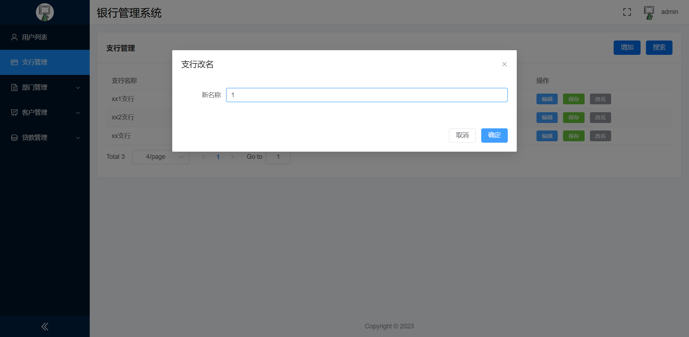

# 银行管理系统 实验报告

## 小组分工

王琛 PB20111696 前后端框架实现、界面ui设计与对应实验报告撰写

王骥扬 PB20111697 需求分析、数据库业务逻辑实现与对应实验报告撰写

## 需求/功能分析

### 需求分析

#### 实体设计

1. 员工：员工号（P）、身份证号、姓名、性别、手机号、住址、工资、入职时间、在单位所处的等级。
2. 部门：部门号（P）、部门名称、部门类型。
3. 支行：支行名称（P）、支行的地理位置、支行总资产。
4. 客户：客户的身份证号（P）、姓名、手机号、住址、邮箱。
5. 账户：账户号（P）、密码、余额、开户日期。
6. 储蓄账户：所需属性包括了账户的所有属性，并且增加利率。
7. 信用账户：所需属性包括了账户的所有属性，并且增加了使用额度。
8. 贷款：贷款号（P）、本金、利率、借贷时间。
9. 贷款支付情况：支付标识号（P）、支付金额、支付日期。

#### 关系设计

1. 隶属关系：一个部门有多个员工，但一名员工只能在一个部门，为一对多联系。
2. 管理关系：一个部门需要一个部门经理管理，一个部门经理只管理一个部门，其中部门经理为员工，为一对一联系。
3. 包含关系：一个支行包含多个部门，一个部门只属于一个支行，为一对多联系。
4. 雇佣关系：一个支行可以雇佣多个员工，但一名员工只能被一个支行雇佣，为一对多联系。
5. 开户关系：一个支行可以开通多个账户，但一个账户只能由一个支行开通，故为一对多关系
6. 拥有关系：一名客户可以拥有多个账户，但一个账户只有一个主人，故为一对多联系。
7. 发放关系：支行可能会发放多份贷款，而一份贷款必然由一个支行发放，为一对多关系。
8. 借贷关系：一名客户可能借多份贷款，而一份贷款只能被一个客户所借，为一对多关系。
9. 支付关系：一份贷款可能会通过多次支付来偿还而一次支付只会对应一份贷款，为一对多关系。
10. 储蓄的继承关系：储蓄账户为账户一种，继承自账户实体。
11. 信用的继承关系：信用账户为账户一种，继承自账户实体。

综上，我们得到函数依赖{员工号$\rightarrow$部门号，部门号$\rightarrow$员工号，部门号$\rightarrow$支行号，员工号$\rightarrow$支行名称，账户号$\rightarrow${支行名称，客户身份证号}，贷款号$\rightarrow$（支行名称，客户身份证号），支付标志$\rightarrow$贷款号}。

### ER图


### 数据库模式


​		与上面的函数依赖进行对比，满足3NF的要求。

## 数据库设计

### 设计框架

​	采用 B/S 架构实现数据库系统，前端采用 Vue 框架，后端采用 Spring Boot 框架，数据库平台使用 Mysql

### 语言

​	NodeJS：Vue

​	Java：Spring Boot

​	Sql：Mysql

### 界面UI设计

​	前端 ui 采用 vue3 中的 element-plus 插件实现

#### css 设计

```css
html {
    -ms-overflow-style: none;
    overflow: -moz-scrollbars-none;
    overflow: hidden;
    overflow-y: scroll;
    scrollbar-width: none;
}

html::-webkit-scrollbar {
    width: 0 !important;
}

body {
    -webkit-text-size-adjust: 100%;
    -moz-osx-font-smoothing: grayscale;
    -webkit-font-smoothing: antialiased;
    text-rendering: optimizeLegibility;
    font-family: Helvetica Neue, Helvetica, PingFang SC, Hiragino Sans GB, Microsoft YaHei, Arial, sans-serif;
}

body,
ol,
ul,
h1,
h2,
h3,
h4,
h5,
h6,
p,
th,
td,
dl,
dd,
form,
fieldset,
legend,
input,
textarea,
select {
    margin: 0;
    padding: 0;
}

a {
    text-decoration: none;
}

a:hover {
    text-decoration: underline;
}

em {
    font-style: normal;
}

img {
    border: 0;
    vertical-align: middle;
}

table {
    border-collapse: collapse;
    border-spacing: 0;
}

p {
    word-wrap: break-word;
}
```

#### 登录界面

​	在 el-card 中使用 el-form 显示登录表单

```vue
<template>
    <div class="login">
        <el-card class="login_center">
            <template #header>
                <div class="card_header">
                    <span>用户登录</span>
                </div>
            </template>
            <el-form :model="loginFormState" :rules="rules" ref="loginFormRef">
                <el-form-item prop="name">
                    <el-input v-model.trim="loginFormState.name" maxlength="32" placeholder="请输入账号" clearable>
                        <template #prefix>
                            <icons name="User"></icons>
                        </template>
                    </el-input>
                </el-form-item>
                <el-form-item prop="pwd">
                    <el-input v-model.trim="loginFormState.pwd" maxlength="16" show-password placeholder="请输入密码" clearable
                        @keyup.enter.exact="handleLogin">
                        <template #prefix>
                            <icons name="Lock"></icons>
                        </template>
                    </el-input>
                </el-form-item>
                <el-form-item>
                    <el-button type="primary" style="width: 100%" :loading="loginFormState.loading" @click="handleLogin">登
                        录</el-button>
                </el-form-item>
            </el-form>
        </el-card>
    </div>
</template>
```


#### 主界面

​	主界面由侧边栏和顶栏组合构成，共同放在 el-container 布局容器中

```vue
<template>
    <el-container class="layout">
        <Aside />
        <el-container>
            <Header />
            <div class="app_wrap">
                <el-main>
                    <router-view />
                </el-main>
                <!-- footer -->
                <el-footer height="48px">Copyright &copy; {{ year }}</el-footer>
                <!-- backtop -->
                <el-backtop target=".app_wrap"></el-backtop>
            </div>
        </el-container>
    </el-container>
</template>
```


##### 侧边栏

​	侧边栏在 el-aside 中嵌套 el-menu 构成，其中侧边栏的菜单由状态管理模式插件 Vuex 动态提供

```vue
<template>
    <el-aside :width="isCollapse ? `64px` : `200px`">
        <div class="logo">
            
        </div>
        <el-menu background-color="#001529" text-color="#eee" active-text-color="#fff" router unique-opened
            :default-active="route.path" :collapse="isCollapse">
            <template v-for="item in routers" :key="item.name">
                <template v-if="!item['hidden']">
                    <el-sub-menu v-if="item.children && item.children.length" :index="concatPath(item.path)">
                        <template #title>
                            <Icons v-if="item.meta.icon" :name="item.meta.icon" />
                            <span>{{ item.meta.title }}</span>
                        </template>
                        <template v-for="sub in item.children" :key="sub.name">
                            <el-menu-item :index="concatPath(item.path, sub.path)">
                                <Icons v-if="sub.meta['icon']" :name="sub.meta['icon']" />
                                <template #title>{{ sub.meta.title }}</template>
                            </el-menu-item>
                        </template>
                    </el-sub-menu>
                    <el-menu-item v-else :index="concatPath(item.path)">
                        <Icons v-if="item.meta['icon']" :name="item.meta['icon']" />
                        <template #title>{{ item.meta.title }}</template>
                    </el-menu-item>
                </template>
            </template>
        </el-menu>
        <div class="fold" @click="changeCollapse">
            <Icons v-if="!isCollapse" name="d-arrow-left" />
            <Icons v-else name="d-arrow-right" />
        </div>
    </el-aside>
</template>
```

##### 顶栏

​	顶栏使用 el-header ，其中包含银行管理系统的标题，用户的名称与用户的头像，全屏与退出全屏按钮。用户的名称与头像由 Vuex动态提供

```vue
<template>
    <el-header height="56px">
        <div class="header_left">银行管理系统</div>
        <div class="header_right">
            <el-tooltip :content="isFullScreen ? '退出全屏' : '全屏'">
                <Icons name="full-screen" @click.stop="handleFullScreen" />
            </el-tooltip>
            <el-dropdown size="medium" @command="handleCommand">
                <div class="user_info">
                    <el-avatar :size="36" :src="avatar" />
                    <span class="username">{{ userName }}</span>
                </div>
                <template #dropdown>
                    <el-dropdown-menu>
                        <el-dropdown-item command="user">个人中心</el-dropdown-item>
                        <el-dropdown-item command="logout">退出登录</el-dropdown-item>
                    </el-dropdown-menu>
                </template>
            </el-dropdown>
        </div>
    </el-header>
</template>
```

##### 数据展示

​	数据表格使用 el-table 显示，按钮使用 el-button 显示，分页使用 el-pagination 显示，对话框使用 el-dialog 显示

```vue
<template>
    <el-card shadow="never" class="index">
        <template #header>
            <div class="card_header">
                <b>用户列表</b>
                <div>
                    <el-button color="#056DE8" @click="addDialogFormVisible = true">增加</el-button>
                    <el-button color="#056DE8" @click="searchDialogFormVisible = true">搜索</el-button>
                </div>
            </div>
        </template>
        <!-- <el-empty description="暂无数据"></el-empty> -->

        <el-table :data="tableData" stripe style="width: 100%">
            <el-table-column prop="name" label="用户名"></el-table-column>
            <el-table-column label="密码">
                <template #default="scope">
                    <el-input v-show="scope.row.showmode" v-model="scope.row.password"></el-input>
                    <p v-show="!scope.row.showmode">{{ scope.row.password }}</p>
                </template>
            </el-table-column>
            <el-table-column label="操作">
                <template #default="scope">
                    <el-button @click="scope.row.showmode = true" type='primary' size="small">编辑</el-button>
                    <el-button @click="handleEdit(scope.row)" type='success' size="small">保存</el-button>
                    <el-button @click="handleDelete(scope.row)" type='danger' size="small">删除</el-button>
                </template>
            </el-table-column>
        </el-table>

        <div style="padding: 10px 0">
            <el-pagination v-model:current-page="currentPage" v-model:page-size="pageSize" :page-sizes="[2, 4, 10, 20]"
                layout="total, sizes, prev, pager, next, jumper" :total="count" @size-change="handleSizeChange"
                @current-change="handleCurrentChange" />
        </div>

        <el-dialog v-model="addDialogFormVisible" title="增加">
            <el-form :model="addForm">
                <el-form-item label="用户名" label-width=100px>
                    <el-input v-model="addForm.name" autocomplete="off" />
                </el-form-item>
                <el-form-item label="密码" label-width=100px>
                    <el-input v-model="addForm.password" autocomplete="off" />
                </el-form-item>
            </el-form>
            <template #footer>
                <span class="dialog-footer">
                    <el-button @click="addDialogFormVisible = false">取消</el-button>
                    <el-button type="primary" @click="handleAdd()">确定</el-button>
                </span>
            </template>
        </el-dialog>

        <el-dialog v-model="searchDialogFormVisible" title="搜索">
            <el-form :model="searchForm">
                <el-form-item label="用户名" label-width=100px>
                    <el-input v-model="searchForm.name" autocomplete="off" />
                </el-form-item>
            </el-form>
            <template #footer>
                <span class="dialog-footer">
                    <el-button @click="searchDialogFormVisible = false">取消</el-button>
                    <el-button type="primary" @click="handleSearch()">确定</el-button>
                </span>
            </template>
        </el-dialog>
    </el-card>
</template>
```


#### 提示信息

​	提示信息使用 ElMessage 显示


### 前端功能实现

#### 进度条

​	进度条使用插件 nprogress 实现，在路由中引入

```javascript
import NProgress from "nprogress";
import "nprogress/nprogress.css";
```

​	在进入路由时开始进度条

```javascript
NProgress.start();
```

​	在退出路由后终止进度条

```javascript
NProgress.done();
```

#### 状态管理

​	状态管理使用插件 Vuex 实现，用于传递用户信息相关的状态。

```javascript
import { createStore } from "vuex";
import { CLEAR_USER, SET_USER, SET_ROUTES } from "./mutation-types";
import { layoutMap } from "@/router/router";
import { filterAsyncRouter } from "../utils/tool";

const state = {
    users: null,
    routers: []
};

const getters = {
    getUserName(state) {
        return !state.users ? "" : state.users.username;
    }
};

const mutations = {
    [CLEAR_USER](state) {
        state.users = null;
        state.routers = [];
    },
    [SET_USER](state, payload) {
        state.users = payload;
    },
    [SET_ROUTES](state, payload) {
        state.routers = payload;
    }
};

const actions = {
    clearUser({ commit }) {
        commit(CLEAR_USER);
    },
    setUser({ commit }, payload) {
        let deepCopy = JSON.parse(JSON.stringify(layoutMap)),
            accessedRouters = filterAsyncRouter(deepCopy, payload.role);
        commit(SET_USER, payload);
        commit(SET_ROUTES, accessedRouters);
    }
};

export default createStore({
    state,
    getters,
    mutations,
    actions
});

```

​	其中状态包含用户名和用户被授权访问的路由信息，定义了设置用户信息与清除用户信息的函数。其中在设置用户信息的函数中，将调用函数时的负载通过 filterAsyncRouter 解析为用户被授权访问的路由信息

```javascript
/* 处理权限 */
export const hasPermission = (route, role) => {
    if (route.meta && route.meta.roles) {
        return route.meta.roles.includes(role);
    }
    return true; /* 默认不设权限 */
};

export const filterAsyncRouter = (routerMap, roles) => {
    const accessedRouters = routerMap.filter(route => {
        if (hasPermission(route, roles)) {
            if (route.children && route.children.length) {
                route.children = filterAsyncRouter(route.children, roles);
            }
            return true;
        }
        return false;
    });
    return accessedRouters;
};

```

​	用户的状态在用户登录时被设置

```javascript
store.dispatch("setUser", params);
```

​	在用户退出登录或登录超时的时候被清空

```javascript
store.dispatch("clearUser");
```

#### 路由

​	路由使用插件 vue-router 实现

```javascript
import { createRouter, createWebHistory } from 'vue-router'
```

​	路由表项共有两项，登录界面与主界面

```javascript
const router = createRouter({
  history: createWebHistory(import.meta.env.BASE_URL),
  routes: [...routes]
})
const routes = [
    {
        path: '/Login',
        name: 'login',
        component: () => import('@/views/Login/Login.vue')
    },
    {
        path: "/",
        name: "Layout",
        component: Layout,
        children: [...layoutMap]
    }
];
```

​	其中 layoutMap 为主界面下的菜单项

```javascript
const layoutMap = [
    {
        path: "user",
        name: "User",
        meta: { title: "用户列表", icon: "User", roles: ["admin"] },
        component: () => import("@/views/Admin/User.vue")
    },
    {
        path: "sub_bank",
        name: "Sub_bank",
        meta: { title: "支行管理", icon: "CreditCard", roles: ["admin"] },
        component: () => import("@/views/Admin/Sub_bank.vue")
    },
    {
        path: "department",
        name: "Department",
        component: RouteView,
        meta: { title: "部门管理", icon: "Document" },
        children: [
            {
                path: "department",
                name: "Department",
                meta: { title: "部门" },
                component: () => import("@/views/Department/Department.vue")
            },
            {
                path: "member",
                name: "Member",
                meta: { title: "员工" },
                component: () => import("@/views/Department/Member.vue")
            },
        ]
    },
    {
        path: "client",
        name: "Client",
        component: RouteView,
        meta: { title: "客户管理", icon: "DataLine" },
        children: [
            {
                path: "client",
                name: "Client",
                meta: { title: "客户" },
                component: () => import("@/views/Client/Client.vue")
            },
            {
                path: "credit_account",
                name: "Credit_account",
                meta: { title: "信用账户" },
                component: () => import("@/views/Client/Credit_account.vue")
            },
            {
                path: "saving_account",
                name: "Saving_account",
                meta: { title: "储蓄账户" },
                component: () => import("@/views/Client/Saving_account.vue")
            }
        ]
    },
    {
        path: "loan",
        name: "Loan",
        component: RouteView,
        meta: { title: "贷款管理", icon: "Coin" },
        children: [
            {
                path: "loan",
                name: "Loan",
                meta: { title: "贷款" },
                component: () => import("@/views/Loan/Loan.vue")
            },
            {
                path: "pay_status",
                name: "Pay_status",
                meta: { title: "支付情况" },
                component: () => import("@/views/Loan/Pay_status.vue")
            }
        ]
    }
];
```

##### 路由守护

​	在路由前验证用户的登录状态，阻止尚未登录的用户访问主界面

​	校验用户是否具有访问菜单的权限，阻止没有权限的用户访问对应的页面

```javascript
router.beforeEach((to, from, next) => {
  NProgress.start();
  const jwt = sessionStorage.getItem('jwt')
  const islogin = !!jwt
  if (islogin) {
    if (to.name === 'login') {
      next({ name: 'Layout' })
    } else if (to.meta.hasOwnProperty("roles")) {
      let roles = to.meta.roles || [];
      let { role } = JSON.parse(jwt);
      if (roles.includes(role)) {
        next()
      } else {
        next({ name: 'Layout' })
      }
    } else {
      next()
    }
  } else {
    if (to.name === 'login') {
      next()
    } else {
      next({ name: 'login' })
    }
  }
})
```

#### 登录验证

​	在登录后，使用 Vuex 存储用户名和路由菜单，使用 sessionStorage 存储后端授权给前端的 token 以及用户的身份信息

```javascript
sessionStorage.setItem("token", res.data.data);
sessionStorage.setItem("jwt", JSON.stringify(params));
store.dispatch("setUser", params);
```

​	在每次请求前，在请求的 headers 中包含保存的 token 交给后端校验

```javascript
request.interceptors.request.use((config) => {
    config.headers['token'] = sessionStorage.getItem('token');
    return config;
}, (error) => {
    return Promise.reject(error);
});
```

​	在请求返回后，查询返回的状态码，若返回 token 不合法，则清空用户信息，此时会自动路由到登录界面

```javascript
request.interceptors.response.use((response) => {
    if (response.data.code === 401 || response.data.code === 402) {
        sessionStorage.clear();
    }
    return response;
}, (error) => {
    return Promise.reject(error);
});
```

#### 前后端交互

​	使用 axios 实现前端和后端之间的跨域访问

```javascript
import axios from "axios";

const request = axios.create({
    baseURL: "http://localhost:8081",
    timeout: 5000,
});
```

##### 页面数据获取与操作

​	将前端的操作转化成对应的 get 或 post 请求发送给后端

```javascript
        const load = () => {
            request({ url: baseurl + "/page", method: "post", params: { page: currentPage.value, size: pageSize.value }, data: searchForm }).then(res => {
                if (res.data.code == 200) {
                    tableData.value = res.data.data.data;
                    count.value = res.data.data.count;
                } else {
                    ElMessage.error(res.data.code + "：" + res.data.message);
                }
            }).catch(err => {
                ElMessage.error(err);
            });
        };

        onMounted(() => {
            load();
        });

        const handleEdit = (data) => {
            request.post(baseurl + "/edit", data).then(res => {
                load();
                if (res.data.code == 200) {
                    ElMessage.success(res.data.message);
                } else {
                    ElMessage.error(res.data.code + "：" + res.data.message);
                }
            }).catch(err => {
                ElMessage.error(err);
            });
            data.showmode = false;
        };

        const handleDelete = (data) => {
            request.post(baseurl + "/delete", data).then(res => {
                load();
                if (res.data.code == 200) {
                    ElMessage.success(res.data.message);
                } else {
                    ElMessage.error(res.data.code + "：" + res.data.message);
                }
            }).catch(err => {
                ElMessage.error(err);
            });
        };

        const handleSizeChange = (number) => {
            pageSize.value = number;
            load();
        };

        const handleCurrentChange = (number) => {
            currentPage.value = number;
            load();
        };

        const handleAdd = () => {
            request.post(baseurl + "/add", addForm).then(res => {
                load();
                if (res.data.code == 200) {
                    ElMessage.success(res.data.message);
                } else {
                    ElMessage.error(res.data.code + "：" + res.data.message);
                }
            }).catch(err => {
                ElMessage.error(err);
            });
            addDialogFormVisible.value = false;
            Object.keys(addForm).forEach(key => {
                addForm[key] = "";
            });
        };

        const handleSearch = () => {
            load();
            searchDialogFormVisible.value = false;
            Object.keys(searchForm).forEach(key => {
                searchForm[key] = "";
            });
        };
```

#### mock

​	使用 mockjs 插件模拟后端，从而分离前后端设计便于调试

```javascript
import Mock from "mockjs"
let userlist = [
    {
        name: "admin",
        password: "123456"
    },
    {
        name: "user",
        password: "111111"
    }
]


Mock.mock("/api/login", "post", (params) => {
    let bodyData = JSON.parse(params.body);

    let result = userlist.find(item => {
        return item.name === bodyData.name && item.password === bodyData.password
    }
    )
    if (result) {
        return {
            code: "0",
            message: "登录成功"
        };
    }
    return {
        code: "1",
        message: "登录失败"
    };
})

Mock.mock("/api/getUserList", "get", () => {
    return {
        data: userlist
    };
})

Mock.mock("/api/editUser", "post", (params) => {
    let bodyData = JSON.parse(params.body);
    let result = userlist.find(item => {
        return item.name === bodyData.name
    }
    )
    if (result) {
        result.password = bodyData.password;
        return {
            code: "0",
            message: "编辑成功"
        };
    }
    return {
        code: "1",
        message: "编辑失败"
    };
})


Mock.mock("/api/addUser", "post", (params) => {
    let bodyData = JSON.parse(params.body);
    userlist.push(bodyData);
    return {
        code: "0",
        message: "添加成功"
    };
})

Mock.mock("/api/deleteUser", "post", (params) => {
    let bodyData = JSON.parse(params.body);
    let index = userlist.findIndex(item => {
        return item.name === bodyData.name
    }
    )
    if (index > -1) {
        userlist.splice(index, 1);
        return {
            code: "0",
            message: "删除成功"
        };
    }
    return {
        code: "1",
        message: "删除失败"
    };
})
```

### 后端功能实现

#### 后端的五层框架

​	后端使用 Spring Boot 实现，总体上包含五层，dto（数据传输层），controller（访问控制层），service（业务逻辑层），mapper（数据库访问层），entity（实体层）

​	在 dto 层中定义了前端与后端传输数据的对象。

​	在 controller 层中定义了后端提供给前端的端口

​	在 service 中实现了各个业务的逻辑实现

​	在 mapper 中实现了后端与数据库的交互，即对应 sql 语句的执行

​	在 entity 中定义了数据库所用的实体，用于执行 sql 语句

#### 后端与前端交互

​	在 controller 层中定义了后端提供给前端的端口，使用 @RequestMapping 与 @PostMapping 将请求映射到对应函数上，使用 @RestController 注解将当前修饰的类注入 SpringBoot IOC 容器的同时将返回值使用 @ResponseBody 修饰，使用 @RequestBody 与 @RequestParam 注解解析请求中含有的参数与负载

```java
@RestController
@RequestMapping("/user")
public class UserController {
    final UserService userService;

    @Autowired
    public UserController(UserService userService) {
        this.userService = userService;
    }

    @PassToken
    @PostMapping("/login")
    public Response login(@RequestBody User user) {
        return userService.login(user);
    }

    @PostMapping("/edit")
    public Response edit(@RequestBody User user) {
        return userService.edit(user);
    }

    @PostMapping("/add")
    public Response add(@RequestBody User user) {
        return userService.add(user);
    }

    @PostMapping("/delete")
    public Response delete(@RequestBody User user) {
        return userService.delete(user);
    }

    @PostMapping("/page")
    public Response page(@RequestParam Integer page, @RequestParam Integer size, @RequestBody User user) {
        return userService.page(page, size, user);
    }
}
```

#### 跨域访问

​	加入跨域访问配置，允许各种类型的跨域访问

```java
@Configuration
public class CrossConfig implements WebMvcConfigurer {
    @Override
    public void addCorsMappings(CorsRegistry registry) {
        registry.addMapping("/**").allowedOriginPatterns("*").allowedMethods("GET", "HEAD", "POST", "DELETE", "OPTIONS", "PUT").allowCredentials(true).maxAge(3600).allowedHeaders("*");
    }
}
```

#### 后端与数据库交互

​	后端使用 Mybatis 与 JDBC 库实现 Java与 Mysql 数据库的交互

​	在 mapper 中实现了后端与数据库的交互，即对应 sql 语句的执行，使用 @Select 和 @Delete 注解将 sql 语句绑定到对应函数上，使用 @Options 注解设置 sql 语句的执行配置

```java
@Mapper
public interface ClientMapper {

    @Options(statementType = StatementType.CALLABLE)
    @Select("Call edit_client ( #{client.client_ID},#{client.real_name},#{client.client_phone},#{client.client_address},#{client.client_email}, #{map.status, mode=OUT, jdbcType=INTEGER});")
    Integer edit(@Param("client") Client client, Map<String, Object> map);

    @Options(statementType = StatementType.CALLABLE)
    @Select("Call register ( #{client.client_ID},#{client.real_name},#{client.client_phone},#{client.client_address},#{client.client_email}, #{map.status, mode=OUT, jdbcType=INTEGER});")
    Integer add(@Param("client") Client client, Map<String, Object> map);

    @Delete("delete from client where client_ID = #{client_ID}")
    void delete(Client client);

    @Select("select count(*) from client where client_ID like concat('%', #{client_ID}, '%') and real_name like concat('%', #{real_name}, '%') and client_phone like concat('%', #{client_phone}, '%') and client_address like concat('%', #{client_address}, '%') and client_email like concat('%', #{client_email}, '%')")
    Integer count(Client client);

    @Select("select client_ID, real_name, client_phone, client_address, client_email from client where client_ID like concat('%', #{client.client_ID}, '%') and real_name like concat('%', #{client.real_name}, '%') and client_phone like concat('%', #{client.client_phone}, '%') and client_address like concat('%', #{client.client_address}, '%') and client_email like concat('%', #{client.client_email}, '%') limit #{start}, #{size}")
    List<Client> page(Integer start, Integer size, @Param("client") Client client);
}
```

#### 异常处理

​	定义异常类继承RuntimeException，并加入 code 表示状态码

```java
@Getter
public class MyException extends RuntimeException {
    private final Integer code;

    public MyException(ResponseEnum responseEnum) {
        super(responseEnum.getMessage());
        this.code = responseEnum.getCode();
    }
}
```

​	加入自定义异常处理，在发生异常时返回响应信息与状态码

```java
@RestControllerAdvice
public class GlobalExceptionConfig {
    @ExceptionHandler(MyException.class)
    public Response handle(MyException e) {
        e.printStackTrace();
        return new Response(e.getCode(), e.getMessage(), null);
    }
}
```

#### jwt鉴权

​	自定义注解 @PassToken ，使用 @PassToken 注解修饰的对象将被排除在 jwt 鉴权之外，用于登录场景

```java
@Target({ElementType.METHOD, ElementType.TYPE})
@Retention(RetentionPolicy.RUNTIME)
public @interface PassToken {
    boolean required() default true;
}
```

​	定义 JwtTokenUtils 用于在用户登录时获取 token

```java
public class JwtTokenUtils {

    private static final long EXPIRE_TIME = 10000 * 60 * 1000;

    public static String getToken(User user) {
        Date date = new Date(System.currentTimeMillis() + EXPIRE_TIME);
        return JWT.create().withAudience(user.getName()).withExpiresAt(date).sign(Algorithm.HMAC256(user.getPassword()));
    }

}
```

​	继承 HandlerInterceptor 定义 JwtInterceptor 在请求前拦截进行 jwt 鉴权，在鉴权失败时直接抛出异常

```java
    public boolean preHandle(HttpServletRequest httpServletRequest, HttpServletResponse httpServletResponse, Object object) throws Exception {
        String token = httpServletRequest.getHeader("token");

        if (!(object instanceof HandlerMethod)) {
            return true;
        }

        HandlerMethod handlerMethod = (HandlerMethod) object;
        Method method = handlerMethod.getMethod();

        if (method.isAnnotationPresent(PassToken.class)) {
            PassToken passToken = method.getAnnotation(PassToken.class);
            if (passToken.required()) {
                return true;
            }
        }

        if (token == null) {
            throw new MyException(ResponseEnum.NO_TOKEN);
        }

        String name;
        try {
            name = JWT.decode(token).getAudience().get(0);
        } catch (JWTDecodeException j) {
            j.printStackTrace();
            throw new MyException(ResponseEnum.TOKEN_FAIL);
        }

        User user = null;
        List<User> userList = userMapper.getList();
        for (User u : userList) {
            if (u.getName().equals(name)) {
                user = u;
                break;
            }
        }

        if (user == null) {
            throw new MyException(ResponseEnum.TOKEN_FAIL);
        }


        JWTVerifier jwtVerifier = JWT.require(Algorithm.HMAC256(user.getPassword())).build();
        try {
            jwtVerifier.verify(token);
        } catch (JWTVerificationException e) {
            throw new MyException(ResponseEnum.TOKEN_FAIL);
        }
        return true;
    }
```

 	继承 WebMvcConfigurer 定义 InterceptorConfig 注册 JwtInterceptor

```java
@Configuration
public class InterceptorConfig implements WebMvcConfigurer {

    private final JwtInterceptor jwtInterceptor;

    @Autowired
    public InterceptorConfig(JwtInterceptor jwtInterceptor) {
        this.jwtInterceptor = jwtInterceptor;
    }

    @Override
    public void addInterceptors(InterceptorRegistry registry) {
        registry.addInterceptor(jwtInterceptor).addPathPatterns("/**");
    }
}
```

### 业务逻辑实现

#### 存储过程

##### 支行重命名

```sql
DELIMITER //
CREATE procedure bank_rename (IN old_name CHAR(30), IN new_name CHAR(30), OUT status INT)
BEGIN
	SET status = 1;
	IF EXISTS (SELECT * FROM sub_bank WHERE sub_bank.bank_name = new_name) AND old_name != new_name THEN
		SET status = 2;
	END IF;
    IF status = 1 THEN
		START TRANSACTION;
		SET FOREIGN_KEY_CHECKS = 0;
        UPDATE department SET department.bank_name = new_name WHERE department.bank_name = old_name;
        UPDATE loan SET loan.bank_name = new_name WHERE loan.bank_name = old_name;
        UPDATE member SET member.bank_name = new_name WHERE member.bank_name = old_name;
        UPDATE credit_account SET credit_account.bank_name = new_name WHERE credit_account.bank_name = old_name;
        UPDATE saving_account SET saving_account.bank_name = new_name WHERE saving_account.bank_name = old_name;
        UPDATE sub_bank SET sub_bank.bank_name = new_name WHERE sub_bank.bank_name = old_name;
        SET FOREIGN_KEY_CHECKS = 1;
        COMMIT;
    END IF;
END //
DELIMITER ;
```

​		先判断新名字是否使用过，若没有使用过，因为要修改其他表的外键，为防止出现读写冲突使用事务来修改相关表的外键约束。

##### 建立支行

```sql
DELIMITER //
CREATE procedure build_bank (IN bank_name CHAR(30), IN bank_location CHAR(30), IN asset INT, OUT status INT)
BEGIN
    SET status = 1;
	IF status = 1 AND asset < 0 THEN
		SET status = 2;
	END IF;
    IF status = 1 AND EXISTS (SELECT * FROM sub_bank WHERE sub_bank.bank_name = bank_name) THEN
		SET status = 3;
	END IF;
	IF status = 1 THEN
		INSERT INTO `bank`.`sub_bank` (`bank_name`, `bank_location`, `asset`) VALUES (bank_name, bank_location, asset);
	END IF;
END //
DELIMITER ;
```

​		在建立支行时，要满足总资产大于0，支行名字未使用，根据支行名字、所在地、资产在支行表中插入新数据。

##### 修改支行资产

```sql
DELIMITER //
CREATE procedure edit_sub_bank (IN bank_name CHAR(30), IN bank_location CHAR(30), IN asset INT, OUT status INT)
BEGIN
	SET status = 1;
	IF status = 1 AND asset < 0 THEN
		SET status = 2;
	END IF;
	IF status = 1 THEN
		UPDATE `bank`.`sub_bank` SET sub_bank.bank_location = bank_location, sub_bank.asset = asset WHERE sub_bank.bank_name = bank_name;
	END IF;
END //
DELIMITER ;
```

​		修改支行的资产时要保证总资产大于0。

##### 修改员工信息

```sql
DELIMITER //
CREATE procedure edit_member (IN id INT, IN depart_no_new INT, IN dep_depart_no_new INT, IN bank_name_new CHAR(30), IN name_new CHAR(30), IN phone_new CHAR(11), IN address_new CHAR(30), IN salary_new INT, IN level_new INT, OUT status INT)
BEGIN
	DECLARE money INT DEFAULT salary_new;
    DECLARE depart_no INT;
    DECLARE dep_depart_no INT;
    DECLARE bank_name CHAR(30);
    DECLARE salary INT;
    DECLARE test_phone INT;
    DECLARE level INT;
	SET status = 1;
    SET test_phone = Length(phone_new);
	IF NOT EXISTS (SELECT * FROM sub_bank WHERE sub_bank.bank_name = bank_name_new)  THEN
		SET status = 2;
	END IF;
	IF status = 1 AND depart_no_new != dep_depart_no_new AND NOT depart_no_new IS NULL THEN
		SET status = 3;
	END IF;
    IF status = 1 AND NOT EXISTS (SELECT * FROM department WHERE department.depart_no = dep_depart_no_new)  THEN
		SET status = 4;
	END IF;
	IF status = 1 AND NOT EXISTS (SELECT * FROM department WHERE department.depart_no = dep_depart_no_new AND department.bank_name = bank_name_new) THEN
		SET status = 5;
	END IF;
    IF salary_new < 0 OR level_new <= 0 THEN
		SET status = 6;
	END IF;
    IF test_phone <> 11 or (SELECT phone_new REGEXP '[^0-9]') = 1 THEN
		SET status = 7;
	END IF;
    IF status = 1 THEN
		START TRANSACTION;
		SET FOREIGN_KEY_CHECKS = 0;
        SELECT member.depart_no, member.dep_depart_no, member.bank_name, member.salary, member.level FROM member WHERE member.id = id INTO depart_no, dep_depart_no, bank_name, salary, level;
        IF level != level_new AND salary = salary_new THEN
			SET money = salary + 3000*(level_new-level);
        END IF;
        UPDATE department SET department.id = NULL WHERE department.depart_no = depart_no;
        UPDATE member, department SET member.depart_no = NULL WHERE member.id = department.id AND department.depart_no = depart_no_new;
		UPDATE department SET department.id = id WHERE department.depart_no = depart_no_new;
        UPDATE member SET member.depart_no = depart_no_new, member.dep_depart_no = dep_depart_no_new, member.bank_name = bank_name_new, member.name = name_new, member.phone = phone_new, member.address = address_new, member.salary = money, member.level = level_new WHERE member.id = id;
		SET FOREIGN_KEY_CHECKS = 1;
        COMMIT;
    END IF;
END //
DELIMITER ;
```

​		在修改员工信息时，我们要保证如果调任他时，调任到的支行、部门存在；如果给他安排为部门的管理者，则他管理的部门与所处的部门应该一致；如果给他升职或降职，升（降）一级工资增加（减少）3000元，在职位与工资同时改变时以工资的改变为准；同时，在修改时，也要验证手机号是否为11位且为0-9的数字。

##### 修改客户数据

```sql
DELIMITER //
CREATE procedure edit_client (IN client_id CHAR(18), IN name_new CHAR(30), IN phone_new CHAR(11), IN address_new CHAR(30), IN email_new CHAR(30), OUT status INT)
BEGIN
	DECLARE test_phone INT;
	SET status = 1;
    SET test_phone = Length(phone_new);
    IF test_phone <> 11 or (SELECT phone_new REGEXP '[^0-9]') = 1 THEN
		SET status = 2;
	END IF;
    IF status = 1 THEN
		START TRANSACTION;
        UPDATE client SET client.real_name = name_new, client.client_phone = phone_new, client.client_address = address_new, client.client_email = email_new WHERE client.client_id = client_id;
        COMMIT;
    END IF;
END //
DELIMITER ;
```

​		在修改客户数据时，主要检验其手机号是否正确。

##### 雇佣员工

```sql
DELIMITER //
CREATE procedure employ (IN dep_depart_no Integer, IN bank_name CHAR(30), IN name CHAR(30), IN sex CHAR(1), IN personal_id CHAR(18), IN phone CHAR(11), IN address CHAR(30), OUT status INT)
BEGIN
	DECLARE max_no INT DEFAULT 0;
    DECLARE next_no INT DEFAULT 0;
    DECLARE test_id INT DEFAULT 0;
    DECLARE test_phone INT DEFAULT 0;
    SET test_id = Length(personal_id);
    SET test_phone = Length(phone);
    SET status = 1;
	IF status = 1 AND test_id <> 18  THEN
		SET status = 2;
	END IF;
    IF status = 1 AND (sex != 'M' AND sex != 'W') THEN
		SET status = 3;
	END IF;
	IF status = 1 AND ((SELECT test_id(personal_id, sex)) = -1) THEN
		SET status = 2;
	END IF;
    IF status = 1 AND (test_phone <> 11 OR ((SELECT phone REGEXP '[^0-9]') = 1)) THEN
		SET status = 4;
	END IF;
	IF status = 1 AND NOT EXISTS (SELECT * FROM department WHERE department.depart_no = dep_depart_no AND department.bank_name = bank_name) THEN
		SET status = 5;
	END IF;
	IF status = 1 THEN
		IF (SELECT COUNT(*) FROM member) != 0 THEN
			SELECT MAX(id) FROM member INTO max_no;
		END IF;
		SET next_no = max_no+1;
		INSERT INTO `bank`.`member` (`id`, `dep_depart_no`, `bank_name`, `name`, `sex`, `person_id`, `phone`, `address`, `salary`, `begin_date`, `level`) VALUES (next_no, dep_depart_no, bank_name, name, sex, personal_id, phone, address, '5000', (Curdate()), '1');
	END IF;
END //
DELIMITER ;
```

​		在雇佣员工时，我们要检验其身份证号是否合理、性别是否填写正确、手机号是否填写正确、雇佣到的支行单位与部门是否存在。为保证员工号这个主键唯一，如果表中存在数据，则找到表中员工号的最大值；若表中没有数据，则定义当前员工号最大值为0，之后在当前最大值的基础上加1即为新入职员工的员工号。在插入一个新数据时，固定新员工的职位等级为1、入职时间为当前时间、初始薪资为5000元。

##### 客户登记

```sql
DELIMITER //
CREATE procedure register (IN client_id CHAR(18), IN real_name CHAR(30), IN client_phone CHAR(11), IN client_address CHAR(30),  IN client_email CHAR(30), OUT status INT)
BEGIN
	DECLARE test_id INT DEFAULT 0;
    DECLARE test_phone INT DEFAULT 0;
    SET test_id = Length(client_id);
    SET test_phone = Length(client_phone);
    SET status = 1;
	IF status = 1 AND test_id <> 18 THEN
		SET status = 2;
	END IF;
	IF status = 1 AND ((SELECT bank.test_id(client_id, 'X')) = -1) THEN
		SET status = 2;
	END IF;
    IF status = 1 AND (test_phone <> 11 OR ((SELECT client_phone REGEXP '[^0-9]') = 1)) THEN
		SET status = 3;
	END IF;
	IF status = 1 AND EXISTS (SELECT * FROM client WHERE client.client_id = client_id) THEN
		SET status = 4;
	END IF;
    IF status = 1 THEN 
		INSERT INTO `bank`.`client` (`client_id`, `real_name`, `client_phone`, `client_address`, `client_email`) VALUES (client_id, real_name, client_phone, client_address, client_email);
 	END IF;
END //
DELIMITER ;
```

​		在客户登记时，我们不需要获取其性别，但需要验证身份证号、手机号，同时一个人不能进行重复注册。进行检查完，插入数据。

##### 办理账户

```sql
DELIMITER //
CREATE procedure get_card (IN card_type INT, IN client_id CHAR(18), IN bank_name CHAR(30), IN card_password CHAR(20), IN remain INT, IN overdraft INT, IN interest_rate FLOAT, OUT status INT)
BEGIN
    DECLARE curr_max INT DEFAULT 0;
    DECLARE max_no INT DEFAULT 0;
    DECLARE next_no INT DEFAULT 1;
    DECLARE test_id INT DEFAULT 0;
    SET status = 1;
	SET test_id = Length(client_id);
    IF card_type = 1 AND EXISTS(SELECT * FROM saving_account Where client_id = saving_account.client_id AND bank_name = saving_account.bank_name) THEN
		SET status = 2;
	END IF;
    IF card_type = 2 AND EXISTS(SELECT * FROM credit_account Where client_id = credit_account.client_id AND bank_name = credit_account.bank_name) THEN
		SET status = 2;
	END IF;
    IF status = 1 AND NOT EXISTS(SELECT * FROM client WHERE client.client_id = client_id) THEN
		SET status = 3;
	END IF;
    IF status = 1 AND NOT EXISTS(SELECT * FROM sub_bank WHERE sub_bank.bank_name = bank_name) THEN
		SET status = 4;
	END IF;
    IF card_type = 1 AND (remain < 0 OR interest_rate < 0.0) THEN
		SET status = 5;
	END IF;
    IF card_type = 2 AND overdraft < 0  THEN
		SET status = 5;
	END IF;
    IF (SELECT COUNT(*) FROM saving_account) != 0 THEN
		SELECT MAX(account_id) FROM saving_account INTO curr_max;
	END IF;
    SET max_no = curr_max;
    IF (SELECT COUNT(*) FROM credit_account) != 0 THEN
		SELECT MAX(account_id) FROM credit_account INTO curr_max;
	END IF;
    IF curr_max > max_no THEN
		SET max_no = curr_max;
	END IF;
	SET next_no = max_no+1;
    
    IF status = 1 THEN
		START TRANSACTION;
		IF card_type = 1 THEN
			INSERT INTO saving_account (`account_id`, `client_id`, `bank_name`, `password`, `remaining`, `open_date`, `interest_rate`) VALUES (next_no, client_id, bank_name, card_password, remain, (Curdate()), interest_rate);
			UPDATE sub_bank SET asset = asset + remain WHERE sub_bank.bank_name = bank_name;
		END IF;
		IF card_type = 2 THEN
			INSERT INTO credit_account (`account_id`, `client_id`, `bank_name`, `password`, `remaining`, `open_date`, `overdraft`) VALUES (next_no, client_id, bank_name, card_password, '0', (Curdate()), overdraft);
		END IF;
		COMMIT;
	END IF;
END //
DELIMITER ;
```

​		当`card_type=1`时为办理储蓄账户，当`card_type=2`时为办理信用账户。在现实中，同一种账户、同一个客户在同一个支行只能开户一个。因此我们首先要判断该用户在该银行是否开户了同类的账户；接下来要判断该客户是否已经注册过以及该支行是否存在；如果是储蓄账户，存入的本金与利率应大于0；如果是信用账户，额度应大于0。在上述均满足后，计算当前账户的卡号，并进行插入操作。

##### 注销账户

```sql
DELIMITER //
CREATE procedure delete_card (IN card_type INT, IN card_id INT, OUT status INT)
BEGIN
    DECLARE remaining INT DEFAULT 0;
    SET status = 1;
    IF card_type = 1 THEN
		SELECT saving_account.remaining FROM saving_account WHERE saving_account.account_id = card_id INTO remaining;
        IF remaining != 0 THEN
			SET status = 2;
		ELSE
            DELETE FROM `bank`.`saving_account` WHERE `account_id` = card_id;
		END IF;
	ELSE
		SELECT credit_account.remaining FROM credit_account WHERE credit_account.account_id = card_id INTO remaining;
        IF remaining != 0 THEN
			SET status = 2;
		ELSE
            DELETE FROM `bank`.`credit_account` WHERE `account_id` = card_id;
		END IF;
	END IF;
END //
DELIMITER ;
```

​		在注销储蓄账户时，若账户里还有存款，应提醒客户将钱取走后再注销账户；在注销信用账户时，若还有额度没有还清，客户应先还清在注销。

##### 信用账户相关操作

```sql
DELIMITER //
CREATE procedure credit_interact (IN type INT, IN card_id CHAR(18), IN money INT, OUT status INT)
BEGIN
    DECLARE remaining INT DEFAULT 0;
    DECLARE overdraft INT DEFAULT 0;
	DECLARE bank_remaining INT DEFAULT 0;
    SET status = -1;
	IF NOT EXISTS (SELECT * FROM credit_account WHERE credit_account.account_id = card_id) THEN
		SET status = -2;
	END IF;
    IF money < 0 THEN
		SET status = -5;
	END IF;
    IF status = -1 THEN
		IF type = 2 THEN
			SELECT credit_account.remaining FROM credit_account WHERE credit_account.account_id = card_id INTO remaining;
            SELECT credit_account.overdraft FROM credit_account WHERE credit_account.account_id = card_id INTO overdraft;
            SELECT sub_bank.asset FROM sub_bank, credit_account WHERE credit_account.account_id = card_id AND credit_account.bank_name = sub_bank.bank_name INTO bank_remaining;
			IF bank_remaining < money THEN
				SET status = -4;
			END IF;
            IF remaining + money > overdraft THEN
				SET status = -3;
			END IF;
            IF status = -1 THEN
				UPDATE credit_account SET credit_account.remaining = credit_account.remaining + money WHERE credit_account.account_id = card_id;
			END IF;
		ELSE
			SELECT credit_account.remaining FROM credit_account WHERE credit_account.account_id = card_id INTO remaining;
			IF remaining < money THEN
				SET status = remaining;
			END IF;
            IF status = -1 THEN
				UPDATE credit_account SET credit_account.remaining = credit_account.remaining - money WHERE credit_account.account_id = card_id;
            END IF;
		END IF;
	END IF;
END //
DELIMITER ;
```

​		当`type=1`时表示还信用卡的额度，当`type=2`时表示使用信用卡。无论是那种操作，首先注意该信用卡是否存在以及操作时对应的数额不能为负数。在使用信用卡时，要判断当前消费的金额加上已使用的额度不能超过总额度以及次消费的金额不能超过银行总资产；在还使用额度时，如果客户的还款大于了使用额度，需要提醒客户还清多少额度即可。在不出现问题时，插入`Update`操作。

##### 储蓄账户相关操作

```sql
DELIMITER //
CREATE procedure saving_interact (IN type INT, IN card_id CHAR(18), IN money INT, OUT status INT)
BEGIN
    DECLARE remaining INT DEFAULT 0;
    DECLARE bank_remaining INT DEFAULT 0;
    SET status = 1;
    IF NOT EXISTS (SELECT * FROM saving_account WHERE saving_account.account_id = card_id) THEN
		SET status = 2;
	END IF;
    IF money < 0 THEN
		SET status = 5;
	END IF;
    IF status = 1 THEN
		IF type = 1 THEN
			UPDATE saving_account SET saving_account.remaining = saving_account.remaining + money WHERE saving_account.account_id = card_id;
		ELSE
			SELECT sub_bank.asset FROM sub_bank, saving_account WHERE saving_account.account_id = card_id AND saving_account.bank_name = sub_bank.bank_name INTO bank_remaining;
			SELECT saving_account.remaining FROM saving_account WHERE saving_account.account_id = card_id INTO remaining;
            IF bank_remaining < money THEN
				SET status = 4;
			END IF;
			IF remaining < money THEN
				SET status = 3;
			END IF;
            IF status = 1 THEN
				UPDATE saving_account SET saving_account.remaining = saving_account.remaining - money WHERE saving_account.account_id = card_id;
			END IF;
		END IF;
	END IF;
END //
DELIMITER ;
```

​		当`type=1`时表示往储蓄账户中存钱，当`type=2`时表示从储蓄账户取钱。无论是那种操作，首先注意该储蓄卡是否存在以及操作时对应的数额不能为负数。在存钱时，插入`Update`操作即可；在取钱时，需要取出的金额小于等于存入的总金额且取出的金额不超过该支行总资产，才可插入`Update`操作。

##### 借贷

```sql
DELIMITER //
CREATE procedure borrow_loan (IN client_id CHAR(18), IN bank_name CHAR(30), IN loan_total INT, IN loan_rate FLOAT,  OUT status INT)
BEGIN
    DECLARE max_no INT DEFAULT 0;
    DECLARE next_no INT DEFAULT 0;
    DECLARE test_id INT DEFAULT 0;
	SET status = 1;
    SET test_id = Length(client_id);
    IF NOT EXISTS(SELECT * FROM client WHERE client.client_id = client_id) THEN
		SET status = 2;
	END IF;
    IF loan_total < 0 OR loan_rate < 0.0 THEN
		SET status = 6;
	END IF;
    IF status = 1 AND EXISTS(SELECT * FROM loan Where client_id = loan.client_id AND bank_name = loan.bank_name AND remain_loan > 0 )  THEN
		SET status = 3;
	END IF;
	IF (SELECT COUNT(*) FROM loan) != 0 THEN
		SELECT MAX(loan_id) FROM loan INTO max_no;
	END IF;
	SET next_no = max_no+1;
    IF status = 1 AND loan_total > (SELECT sub_bank.asset FROM sub_bank Where sub_bank.bank_name = bank_name) THEN
		SET status = 4;
	END IF;
	IF status = 1 AND NOT EXISTS(SELECT * FROM sub_bank WHERE sub_bank.bank_name = bank_name) THEN
		SET status = 5;
	END IF;
    IF status = 1 THEN
		INSERT INTO `bank`.`loan` (`loan_id`, `client_id`, `bank_name`, `loan_total`, `remain_loan`, `loan_Date`, `loan_rate`) VALUES (next_no, client_id, bank_name, loan_total, loan_total, (Curdate()), loan_rate);
		UPDATE `bank`.`sub_bank` SET asset = asset - loan_total WHERE sub_bank.bank_name = bank_name;
	END IF;
END //
DELIMITER ;
```

​		在借贷时，要判断客户已经注册、借贷金额大于0、贷款利率大于0。根据实际分析，同一客户在同一银行如果有贷款没有还清，则不能贷款。贷款金额不能超过该支行总资产且支行应该存在。在上述要求满足下，计算出应该的贷款号，执行插入操作，同时对支行进行`Update`操作减少总资产。

##### 还贷

```sql
DELIMITER //
CREATE procedure return_loan (IN loan_id CHAR(30), IN pay_money INT,  OUT status INT)
BEGIN
    DECLARE max_no INT DEFAULT 0;
    DECLARE next_no INT DEFAULT 0;
    DECLARE loan_remain INT DEFAULT 0;
    SET status = -1;
	IF (SELECT COUNT(*) FROM pay_status) != 0 THEN
		SELECT MAX(pay_id) FROM pay_status INTO max_no;
	END IF;
    IF NOT EXISTS(SELECT * FROM loan WHERE loan.loan_id = loan_id) THEN
		SET status = -2;
    END IF;
    IF pay_money < 0 THEN
		SET status = -3;
	END IF;
    SELECT loan.remain_loan FROM loan WHERE loan.loan_id = loan_id INTO loan_remain;
	SET next_no = max_no+1;
    IF pay_money > loan_remain THEN
		SET status = loan_remain;
	END IF;
    IF status = -1 THEN
		INSERT INTO `bank`.`pay_status` (`pay_id`, `loan_id`, `Pay_money`, `Pay_date`) VALUES (next_no, loan_id, pay_money, (Curdate()));
	END IF;
END //
DELIMITER ;
```

​		还贷时要判断目标贷款号是否存在，且还款金额要大于等于0。如果还贷金额大于剩余贷款金额，提醒客户需要还多少金额即可。在满足要求下，计算还贷标识，同时插入还贷信息。

##### 计算各种利率

```sql
DELIMITER //
CREATE procedure calculate_loan_formal ()
BEGIN
	DECLARE state INT DEFAULT 0;
    DECLARE curr_loan INT DEFAULT 0;
    DECLARE curr_remain INT DEFAULT 0;
    DECLARE curr_rate FLOAT DEFAULT 0;
    DECLARE curr_id INT DEFAULT 0;
    DECLARE borr_date DATE;
	DECLARE cs_loan CURSOR FOR (SELECT loan_id, remain_loan, loan_rate FROM loan);
	DECLARE cs_saving CURSOR FOR (SELECT account_id, remaining, interest_rate FROM saving_account);
    DECLARE CONTINUE HANDLER FOR NOT FOUND SET state = 1;
    OPEN cs_loan;
    REPEAT
		FETCH cs_loan INTO curr_id, curr_loan, curr_rate;
        IF state = 0 AND curr_loan > 0 THEN
			SELECT loan_date FROM loan WHERE loan.loan_id = curr_id INTO borr_date;
			IF datediff((Curdate()), borr_date) % 30 = 0 THEN
				UPDATE  `bank`.`loan` SET loan.remain_loan = (curr_loan + CAST(curr_loan*curr_rate as signed)) WHERE loan.loan_id = curr_id;
			END IF;
		END IF;
        UNTIL state = 1
	END REPEAT;
    CLOSE cs_loan;
    SET state = 0;
    OPEN cs_saving;
    REPEAT
		FETCH cs_saving INTO curr_id, curr_remain, curr_rate;
        IF state = 0 THEN
			SELECT open_date FROM saving_account WHERE saving_account.account_id = curr_id INTO borr_date;
			IF datediff((Curdate()), borr_date) % 30 = 0 THEN
				START TRANSACTION;
				SET @enable_trigger = 0;
				UPDATE  `bank`.`saving_account` SET saving_account.remaining = (curr_remain + CAST(curr_remain*curr_rate as signed)) WHERE saving_account.account_id = curr_id;
				SET @enable_trigger = 1;
                COMMIT;
			END IF;
		END IF;
        UNTIL state = 1
	END REPEAT;
    CLOSE cs_saving;
END //
DELIMITER ;
```

​		在此处使用游标。对每个贷款，每月计算利润并加到剩余的本金上；对每个储蓄账号，计算每月的利润并加到本金上，此时要关闭**trigger**，因为在此时，虽然账户的金额改变，但银行总资产不能改变。最后使用`event`即可完成这种更新操作

```sql
CREATE EVENT update_event_formal
ON SCHEDULE EVERY 1 day STARTS NOW() ON COMPLETION PRESERVE DO 
CALL calculate_loan_formal ();
```


#### 函数

##### 身份证正确性计算

```sql
DELIMITER //
CREATE Function test_id(id CHAR(18), sex CHAR(1))
RETURNS INT
READS SQL DATA
BEGIN
	DECLARE curr_num INT DEFAULT 0;
    DECLARE total_num INT DEFAULT 0;
    DECLARE flag CHAR(1) DEFAULT '0';
    DECLARE born_year INT DEFAULT 0;
    DECLARE born_month INT DEFAULT 0;
    DECLARE born_day INT DEFAULT 0;
    DECLARE sex_no INT DEFAULT 0;
    DECLARE id_first CHAR(17);
    DECLARE id_last CHAR(1);
    DECLARE j INT DEFAULT 1;
    DECLARE status INT DEFAULT 0;
	SELECT SUBSTRING(id, 1, 17) INTO id_first;
    SELECT SUBSTRING(id, 18, 1) INTO id_last;
    IF (SELECT id_last REGEXP '[^0-9x]') = 1 OR (SELECT id_first REGEXP '[^0-9]') = 1 THEN
		SET status = -1;
        return status;
	END IF;
    SELECT Cast(SUBSTRING(id, 7, 4) AS SIGNED) INTO born_year;
	SELECT Cast(SUBSTRING(id, 11, 2) AS SIGNED) INTO born_month;
    SELECT Cast(SUBSTRING(id, 13, 2) AS SIGNED) INTO born_day;
    SELECT Cast(SUBSTRING(id, 17, 1) AS SIGNED) INTO sex_no;
    IF born_month > 12 THEN
		SET status = -1;
        return status;
	END IF;
    CASE
		WHEN born_month = 1 AND born_day > 31 THEN 
			SET status = -1;
            return status;
        WHEN born_month = 3 AND born_day > 31 THEN 
			SET status = -1;
            return status;
		WHEN born_month = 5 AND born_day > 31 THEN 
			SET status = -1;
            return status;
		WHEN born_month = 7 AND born_day > 31 THEN 
			SET status = -1;
            return status;
		WHEN born_month = 8 AND born_day > 31 THEN 
			SET status = -1;
            return status;
		WHEN born_month = 10 AND born_day > 31 THEN 
			SET status = -1;
            return status;
		WHEN born_month = 12 AND born_day > 31 THEN 
			SET status = -1;
            return status;
		WHEN born_month = 4 AND born_day > 30 THEN 
			SET status = -1;
            return status;
		WHEN born_month = 6 AND born_day > 30 THEN 
			SET status = -1;
            return status;
		WHEN born_month = 9 AND born_day > 30 THEN 
			SET status = -1;
            return status;
		WHEN born_month = 11 AND born_day > 30 THEN 
			SET status = -1;
            return status;
		WHEN born_month = 2 AND born_day > 29 AND born_year % 4 = 0 THEN 
			SET status = -1;
            return status;
		WHEN born_month = 2 AND born_day > 28 AND born_year % 4 != 0 THEN 
			SET status = -1;
            return status;
		ELSE
			SET status = 1;
    END CASE;
    IF sex != 'X' THEN
		IF sex_no%2 = 1 AND sex != 'M' Then
			SET status = -1;
			return status;
		END IF;
		IF sex_no%2 = 0 AND sex != 'W' Then
			SET status = -1;
			return status;
		END IF;
	END IF;
    SET total_num = 0;
    WHILE j <= 17 DO
		SELECT Cast(SUBSTRING(id, j, 1) AS SIGNED) INTO curr_num;
		CASE
			WHEN j = 1 THEN		SET total_num = total_num+curr_num*7;
            WHEN j = 2 THEN		SET total_num = total_num+curr_num*9;
            WHEN j = 3 THEN		SET total_num = total_num+curr_num*10;
            WHEN j = 4 THEN		SET total_num = total_num+curr_num*5;
            WHEN j = 5 THEN		SET total_num = total_num+curr_num*8;
            WHEN j = 6 THEN		SET total_num = total_num+curr_num*4;
            WHEN j = 7 THEN		SET total_num = total_num+curr_num*2;
            WHEN j = 8 THEN		SET total_num = total_num+curr_num*1;
            WHEN j = 9 THEN		SET total_num = total_num+curr_num*6;
            WHEN j = 10 THEN	SET total_num = total_num+curr_num*3;
            WHEN j = 11 THEN	SET total_num = total_num+curr_num*7;
            WHEN j = 12 THEN	SET total_num = total_num+curr_num*9;
            WHEN j = 13 THEN	SET total_num = total_num+curr_num*10;
            WHEN j = 14 THEN	SET total_num = total_num+curr_num*5;
            WHEN j = 15 THEN	SET total_num = total_num+curr_num*8;
            WHEN j = 16 THEN	SET total_num = total_num+curr_num*4;
            ELSE				SET total_num = total_num+curr_num*2;
        END CASE;
		SET j = j+1;
	END WHILE;
    SET total_num = total_num % 11;
    CASE
		WHEN total_num = 0 THEN		SET flag = '1';
        WHEN total_num = 1 THEN		SET flag = '0';
        WHEN total_num = 2 THEN		SET flag = 'x';
        WHEN total_num = 3 THEN		SET flag = '9';
        WHEN total_num = 4 THEN		SET flag = '8';
        WHEN total_num = 5 THEN		SET flag = '7';
        WHEN total_num = 6 THEN		SET flag = '6';
        WHEN total_num = 7 THEN		SET flag = '5';
        WHEN total_num = 8 THEN		SET flag = '4';
        WHEN total_num = 9 THEN		SET flag = '3';
        WHEN total_num = 10 THEN	SET flag = '2';
    END CASE;
    IF flag != SUBSTRING(id, 18, 1) THEN
		SET status = -1;
        return status;
	END IF;
    return status;
    
END //
DELIMITER ;
```

​		先判断前17位是否全是0-9，最后一位是不是0-9或x，再判断出生日期是否满足要求。若满足，在性别不为x（未给出下），男生（M）的倒数第二位应为奇数，女生（W）为偶数。最后根据身份证校验码的计算方式，判断身份证的最后一位是否与前十七位通过校验算法得出的结果一致。在上述条件均满足下，返回0，否则-1。

#### 事务

​	具体可参考存储过程的实现，比如**支行重命名**、**修改员工信息**、**计算各种利率**等

#### 触发器

```sql
DELIMITER //
CREATE trigger Decrease AFTER Insert ON Pay_status FOR EACH ROW 
BEGIN
	UPDATE loan SET loan.remain_loan = (loan.remain_loan - NEW.Pay_money) Where loan.loan_id = NEW.loan_id;
	UPDATE `bank`.`sub_bank`, `bank`.`loan` SET asset = asset + NEW.Pay_money WHERE sub_bank.bank_name = loan.bank_name AND loan.loan_id = NEW.loan_id;
END //
DELIMITER ;

DELIMITER //
CREATE trigger credit_bank AFTER UPDATE ON credit_account FOR EACH ROW 
BEGIN
	IF @enable_trigger = 1 THEN
		UPDATE `bank`.`sub_bank` SET asset = asset - NEW.remaining + OLD.remaining WHERE sub_bank.bank_name = NEW.bank_name;
	END IF;
END //
DELIMITER ;

DELIMITER //
CREATE trigger saving_bank AFTER UPDATE ON saving_account FOR EACH ROW 
BEGIN
	IF @enable_trigger = 1 THEN
		UPDATE `bank`.`sub_bank` SET asset = asset + NEW.remaining - OLD.remaining WHERE sub_bank.bank_name = NEW.bank_name;
    END IF;
END //
DELIMITER ;
```

​		在还贷款时，使用触发器增加对应支行的总资产。在信用账户金额变化时，修改对应支行的总资产。在储蓄账户金额变化时（利润计算时除外），修改对应支行的总资产。

## 单元/综合测试

### 初始状态


### 支行操作

#### 建立支行


#### 建立成功


#### 支行改名

此处为对“xx1支行”改名为“1”。



#### 改名结果


#### 支行其他信息修改


#### 修改结果


### 部门操作

#### 创建部门


#### 创建成功


#### 修改信息


#### 修改成功


### 员工操作

#### 插入员工

##### 身份证号错误情况


##### 输入信息无误


##### 结果


#### 修改员工信息


#### 修改结果


​		可以看到在修改等级后，薪资也增加了；在部门对应的管理者也在人员改变任职时发生了变化。

### 客户操作

#### 插入用户


#### 插入成功


### 信用账户操作

#### 开户


#### 使用


可以看到在使用信用卡时，支行总资产也发生了变化

#### 还款


可以看到在还款后，支行总资产也发生了变化

### 储蓄账户操作

​		此功能与信用账户操作大致相同，故不赘述。

### 借贷操作


可以看到在借贷后，支行总资产也发生了变化

### 还贷操作


可以看到在借贷后，本金与支行总资产也发生了变化

## 实验总结

​		经过本次实验，我们对于数据库系统开发有了更深入的理解，完整经历了学习、设计、实现的过程，代码能力有了长足的提高，也学习到了Vue、Spring Boot等好用的框架，收获颇丰。同时也巩固了课内所学的知识，培养了分工交流的能力，是一次很宝贵的经历。